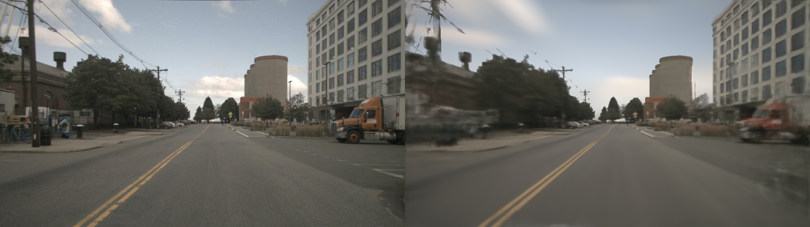

# Master Thesis of LinGaoyuan

Hello, my name is Lin Gaoyuan, and I am currently pursuing a master’s degree in Automotive Engineering at TUM. This repository is relevant to the result of my master thesis.


## Introduction

This project is my master thesis, which is mainly focus on the application of transformer network based NeRF model in outdoor scenario.  My master thesis was completed at [TUM info6](https://www.ce.cit.tum.de/air/home/).  The supervisor of my master thesis is [Prof. Dr.-Ing. habil. Alois C. Knoll](https://www.ce.cit.tum.de/air/people/prof-dr-ing-habil-alois-knoll/), while the advisor is Xiang Gao, M.Sc. Here I would like to thank them for their guidance and help in my master thesis.

In this repository I will show the results of my master thesis, the relevant code will be illustrated in Github after my oral defense. 

The data used for this project comes from the NuScene dataset.

Due to the limitation of computational resource(RTX4090) and training time(10 hour), I can only generate finally reconstructed effect with 26.82 PSNR and 0.8488 SSIM. I believe the performance can be further enhance in the future.


Here give some example of my result, left is ground truth image, right is predicted image:




## Cite this work

If you find my work useful for your own research, please consider citing:

```
@inproceedings{
    LinGaoyuan-master-thesis,
    title={The Application of Transformer-based Models in Dynamic Outdoor Scenarios},
    author={Gaoyuan Lin},
    year={2024},
    url={}
}
```
